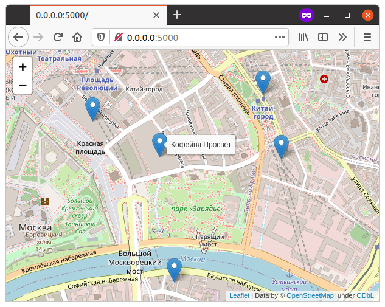

# Ищем где выпить кофе

Вадим любит кофе и не любит ходить пешком. Поэтому ему пришла в голову идея сделать кофейную карту – в прямом смысле этого слова.

Принцип работы предельно прост: пользователь вводит свой текущий адрес, а приложение показывает на карте топ-5 кофеен неподалёку.

## Требования

Для запуска вам понадобится Python 3.6 или выше.

Необходимо получить ключ для доступа к геокодеру Яндекса. Подробная инструкция [как получить ключ](https://yandex.ru/dev/maps/geocoder/).

## Переменные окружения

Настройки проекта берутся из переменных окружения. Чтобы их определить, создайте файл `.env` рядом с `main.py` и запишите туда данные в таком формате: `ПЕРЕМЕННАЯ = значение`.

Доступные переменные:

- `COFFEE_API_KEY` — ключ для доступа к геокодеру Яндекса. 

Пример:

```env
COFFEE_API_KEY = ab1234c5-6789-0de1-fgij-2345klmnop
```

## Запуск

Скачайте код с GitHub. Установите зависимости:

```sh
pip install -r requirements.txt
```

Запустите скрипт:

```sh
python main.py
```

Пример вывода:
```sh
Где вы находитесь? Зарядье
Ваши координаты: ('55.751244', '37.629017')

 * Serving Flask app "main" (lazy loading)
 * Environment: production
   WARNING: This is a development server. Do not use it in a production deployment.
   Use a production WSGI server instead.
 * Debug mode: off
 * Running on http://0.0.0.0:5000/ (Press CTRL+C to quit)
```

Теперь нужно запустить браузер и перейти по адресу `http://0.0.0.0:5000/`.  
Вы увидите карту с отмеченными кофейнями:




## Цели проекта

Код написан в учебных целях — для курса по Python на сайте [Devman](https://dvmn.org).
